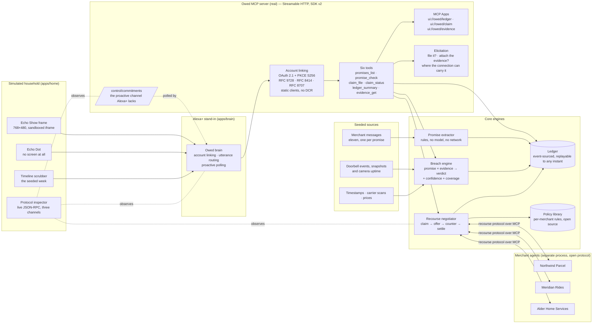
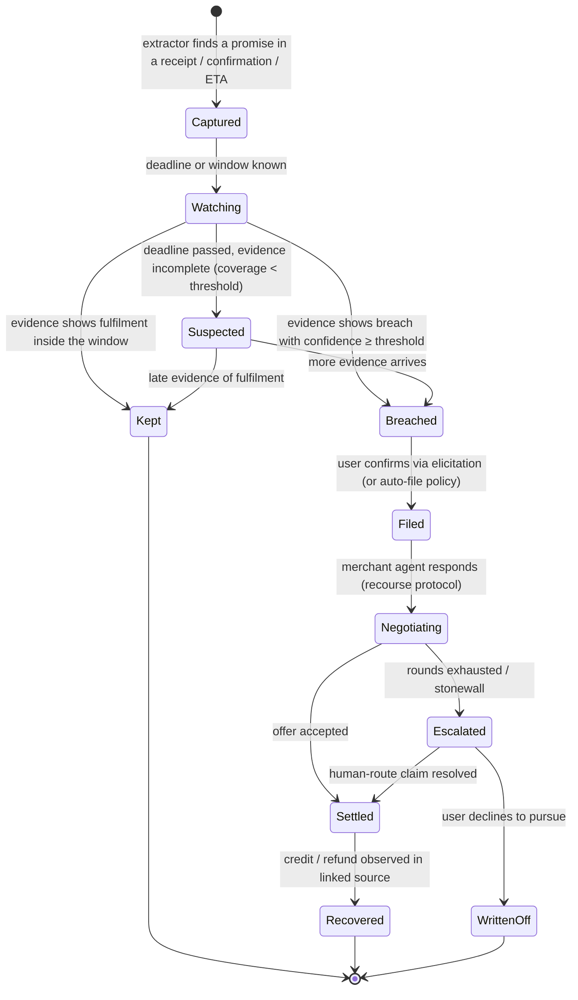

# Owed — the Alexa+ add-on that works for the customer, not the brand

> **"Alexa, what am I owed?"**
> Owed records every promise a business makes to your household — a delivery window, a ride ETA, a refund SLA, a guarantee — notices when it's broken, and collects what you're owed by negotiating with the merchant's agent. You never lift a finger.

Built for **Build, Ship, Shape: Amazon Developer Hackathon 2026** — Alexa+ primary track, AWS Builder and Open Source mini-challenges.

---

## 1. Thesis

Every Alexa+ add-on shipped so far exists so a *brand* can reach a customer. The Alexa+ store is a distribution channel. Owed is the inversion: an add-on whose principal is the **household**, sitting on the customer's side of every transaction those brands run through Alexa.

- **Before** a transaction: nothing to do — you buy, ride, book as usual.
- **During**: Owed captures the promise at the moment it is made (from receipts, confirmations, ETAs).
- **After**: Owed detects the breach with evidence, files the claim, and settles it agent-to-agent with the merchant's agent.

Businesses price in the fact that almost nobody claims. Owed removes the effort, so the breakage comes home.

**Why it belongs in Alexa+:** the design guide asks that an add-on "do at least one thing better because it lives in Alexa+". The promise is captured *in the conversation where it is made*, and the outcome is spoken back in the room where the household lives. Amazon reports customers engage 6× more with integrated services; that only scales if the customer trusts the agent's transactions. Owed is the consumer-side accountability layer — the mirror image of Amazon Wallet.

---

## 2. What the judge sees (90-second storyboard)

*Every beat below is asserted by [`scripts/verify-ui.mjs`](scripts/verify-ui.mjs), which
drives this exact sequence in a real Chrome and checks the numbers on the cards. The
figures here are the figures it reads.*

| t | Surface | What happens |
|---|---|---|
| 0:00 | Echo Show (Sun 19:30) | *"Alexa, what am I owed?"* → **Recovered this week $47.00 · Still open $8.00 · 2 kept.** Spoken: "You've recovered forty-seven dollars this week, and eight dollars is still open. Two promises were kept. There's one I'm not claiming, because I only watched twenty percent of the window. There's one more I can file." |
| 0:15 | Echo Show | *"Why aren't you claiming that?"* → the evidence card. A coverage bar with the unwatched stretches **cut out where they actually fell**, the verdict *not enough to claim*, and — quoted under **they wrote** — the merchant's own sentence the promise was read out of. |
| 0:30 | Timeline scrubber | The judge drags back to Monday and forward across the week. Every tool answers for the clock, so the ledger empties and refills as they scrub. |
| 0:45 | Echo Show | Crossing Sunday evening, **Owed speaks first**, badged `simulated proactive`: "Northwind Parcel missed the delivery window they promised. They owe you eight dollars under their own policy. Shall I file it?" The inspector shows the `CommitmentEvent` on its own channel — the shape Alexa+ would have to emit, because it has no such channel today. |
| 1:00 | Echo Show | *"File it."* → **Asked · They offered · Countered · Settled**, at **$8.00**. The counter cites **Delivery Guarantee 4.1** — the merchant's own published clause. |
| 1:10 | Protocol inspector | The argument itself, on the wire: `tools/call claim_file`, then the recourse exchange with Northwind Parcel's agent nested inside it, then the result that argument produced. Sorted into causal order, not arrival order. |
| 1:20 | Echo Dot | Same questions, **no screen at all**. The answers still stand on their own, which is the only honest way to show voice-only parity. |
| 1:30 | Close | "Alexa+ will have hundreds of add-ons that sell to you. This is the one that represents you." |

---

## 3. System architecture

*This is what exists. Everything the ideation proposed and we did not build is listed in
§13, by name.*



**Real:** the MCP server and everything under it — Streamable HTTP, the OAuth authorization
server, the six tools, the three `ui://` views, elicitation, the event-sourced ledger, the
breach engine, the rule extractor, the negotiator, and the merchant agents, which run in
their own process and are argued with over HTTP rather than called in-process.

**Simulated, and labelled as such wherever it appears:** the Alexa+ orchestrator, NLU and
voice pipeline; proactive delivery, because Alexa+ add-ons have no such channel; the device
frames; and the household's evidence sources, which are seeded rather than live.

---

## 4. Promise lifecycle



Every transition is an event in the ledger. The card and the "recovered this week" number are projections of the event log.

---

## 5. Sequence — the phantom-delivery claim


---

## 6. MCP surface (the real add-on contract)

Server: TypeScript, `@modelcontextprotocol/server` 2.x, **Streamable HTTP**, protocol **2025-11-25**, stateless request handling with ledger-backed state. Target tool latency < 500 ms (breach detection runs async; tools read state).

### 6.1 Account linking
OAuth 2.1 + PKCE (S256), discovery via RFC 9728 (protected resource metadata) and RFC 8414 (AS metadata), audience binding via RFC 8707, loopback redirects per RFC 8252. Owed runs **its own authorization server** — the MCP SDK ships none — and the brain walks the real authorization-code flow rather than being handed a token out of band.

**Static clients, no dynamic registration.** Amazon's documentation says Alexa+ does not support RFC 7591, so the server does not offer it: a client is configured in advance or it does not link. Passes `npx mcp-voice-simulator-conformance` on every documented check (run inside `pnpm verify`).

### 6.2 Tools

| Tool | Input | Output | UI |
|---|---|---|---|
| `ledger.summary` | `{period?: "week"\|"month"}` | `{recovered, open, kept, items[]}` | `ui://owed/ledger` |
| `promises.list` | `{status?: PromiseStatus, merchant?}` | `{promises[]}` | `ui://owed/ledger` |
| `promise.check` | `{promise_id}` | `{status, breach?, coverage, evidence[]}` | `ui://owed/evidence` |
| `claim.file` | `{promise_id, attach_evidence?: boolean}` | `{claim_id, state, offer?, settled?}` (may elicit) | `ui://owed/claim` |
| `claim.status` | `{claim_id}` | `{state, rounds[], amount?}` | `ui://owed/claim` |
| `evidence.get` | `{evidence_id}` | `{kind, uri, captured_at, coverage}` | `ui://owed/evidence` |

All tool results carry `content[]` (text fallback for voice-only devices), `structuredContent`, and `_meta.ui.resourceUri` per the Alexa+ client lifecycle. Tool signatures are frozen after v1 (Alexa+ locks them at certification).

### 6.3 MCP Apps (views)
- `ui://owed/ledger` — headline number, three-item list, one action. 768×480 base canvas, root scale for Echo Show 8/15, 1.6 typography ratio, Alexa tokens.
- `ui://owed/claim` — offer → counter → settled timeline; two-column agent transcript, collapsed by default.
- `ui://owed/evidence` — coverage bar ("watched 82% of window"), snapshots, gaps stated explicitly.
Views are sandboxed iframes with CSP; they call back only via `postMessage` (host bridge), never fetch directly.

### 6.4 Elicitation
Form-mode, flat primitives only — which is the whole of what the spec permits. Both of v1's
questions (*file it?* and *attach the doorbell evidence?*) are asked in **one round** rather
than serially; being asked twice about one claim is worse, not better.

Elicitation runs **only where the connection can carry it.** On the 2026-07-28 revision the
request rides in the result and the client retries, so it works under per-request serving. On
the 2025-11-25 revision it is a server-to-client request that needs a session, and per-request
serving cannot make one — so there `claim_file` proposes in words and waits for `confirm`.
Both paths are tested, including decline. See docs/friction-log.md §10–11; the second is an SDK
bug we shipped from its own worked example before a test caught it.

**The demo deliberately takes the `confirm` path.** The brain connects on **2025-11-25**,
the revision Amazon's Alexa+ documentation names, precisely so the demo runs on the
protocol Alexa+ actually speaks — and on that revision, served per-request, elicitation
cannot happen at all. Switching the brain to 2026-07-28 would light up the elicited round
trip on screen and would mean demonstrating a primitive on a revision Alexa+ does not use.
The elicited path is exercised by the contract suite instead, on a modern-era connection,
end to end with a client that answers.

---

## 7. Recourse protocol (open spec, `packages/recourse-protocol`)

Agent-to-agent dispute resolution, MCP-shaped so any merchant agent can implement it as tools.

```
CLAIM    { claim_id, promise, evidence_pack{items[], coverage}, policy_ref, ask }
OFFER    { claim_id, amount, form: credit|refund|reship, terms }
COUNTER  { claim_id, amount, justification{policy_clause, evidence_ids[]} }
SETTLE   { claim_id, amount, form, reference }
DECLINE  { claim_id, reason, escalation_route }
```

Rules: max N rounds (default 3); every message signed with the claim id; evidence is referenced, never re-sent; a `DECLINE` must carry a human escalation route. Negotiator strategy: reservation value from the policy library, concession schedule by merchant type, stop on `SETTLE ≥ reservation` or rounds exhausted.

Merchant agents in `packages/merchant-agents` are configured per merchant *and breach kind*, because that is what is actually true of merchants: Calder & Co. settles its price promise on request and contests its refund timing, from one configuration. The eval harness runs the **full pre-registered grid of 270 policies × 6 breach kinds = 1,620 negotiations**, including merchants that withdraw an offer when countered.

---

## 8. Core engines

### 8.1 Promise extractor
Input: a message (receipt / confirmation / ETA notification). Output: typed `Promise`:
```ts
type Promise = {
  id: string; household_id: string; merchant: string; source_ref: string;
  kind: "delivery_window" | "eta" | "refund_sla" | "appointment_slot" | "guarantee" | "price_match" | "warranty";
  made_at: string; window?: { start: string; end: string }; deadline?: string;
  amount_at_stake?: number; currency: string; policy_ref?: string; confidence: number;
};
```
**Rules, not a model** — `packages/extractor`, no network and no AWS. It finds time expressions first and classifies each by the words around it, rather than running seven regexes at the text: "between 1 and 5" is a delivery window, an engineer's visit or a shop's opening hours depending entirely on its neighbours. A cue before the clock beats one after it, and a word that can only mean one thing (engineer, warranty, price match) outranks a generic verb sitting nearer.

Every extraction carries the sentence it was read from. That is not decoration: **the evidence card quotes it**, under "they wrote", so a household can check the promise against the merchant's own words rather than take Owed's reading on trust.

The storyboard's promises stay authored, so the demo is deterministic whatever the extractor does next — but each one now has the message it claims to come from, and [`extraction.test.ts`](packages/mcp-server/src/seed/extraction.test.ts) runs the real extractor over that message and asserts it recovers the promise **to the minute**. The `source_ref` on every promise used to point at nothing.

Measured on 120 labelled messages and, separately, on 40 held out — see §10 and `eval/README.md`. The held-out number is the one that means anything.

### 8.2 Breach engine
`breach = f(promise, evidence[])` → `{kind, confidence, coverage, evidence_ids, explanation}`.
- Coverage = fraction of the promise window observed by any evidence source. Below threshold → `Suspected`, never `Breached`. The card says what was and wasn't seen.
- Breach kinds v1: `late_eta`, `missed_window`, `phantom_delivery`, `no_show`, `late_refund`, `price_drop`.
- Evidence kinds v1: `timestamp`, `carrier_scan`, `doorbell_event`, `doorbell_snapshot`, `refund_observed`.

### 8.3 Ledger
Append-only and event-sourced (`PromiseCaptured`, `EvidenceObserved`, `PromiseAssessed`, `ClaimProposed`, `ClaimFiled`, `Settled`, `Recovered`, …). Every event carries both `occurred_at`, when the thing happened in the household's week, and `recorded_at`, when Owed learned of it — so the ledger replays to any instant and every tool answers for the clock rather than for now. That is what makes the timeline scrubber truthful rather than cosmetic.

**In memory by default, on disk when you ask.** A demo that reseeds identically every run is worth more than one that drifts, so memory is the default. `OWED_DB=owed.db` swaps in a SQLite store built on Node's own `node:sqlite` — no dependency added — and then the seed is written only if the file is empty, because reseeding a ledger that already holds a week would append a second copy of everything. There is no `UPDATE` and no `DELETE` in that adapter; `seq` is insertion order and is the primary key. Rows are parsed back through the event schema on read, so a stale write or a hand edit is a loud failure rather than a card quietly showing something impossible.

### 8.4 Speaking first (`CommitmentEvent`)
Alexa+ add-ons are strictly reactive: a tool runs because somebody said something. For most add-ons that is a limitation; for Owed it removes the product, because Owed exists to notice what the household did *not* ask about.

So the one primitive we need is the one that does not exist, and we wrote it down as a schema rather than a paragraph in a feedback form: **`CommitmentEvent`**, carrying `expires_at` (proactive speech has to be allowed to go stale), `urgency` (only the add-on knows whether money is about to stop being recoverable) and `offer` (without it, an announcement is a dead end).

The server exposes everything Owed would say unprompted as a **projection of the ledger**, not a queue — so scrubbing the week backwards takes an announcement away again instead of replaying it. The brain polls, announces what has newly fallen due, and the home badges every one `simulated proactive`. The inspector shows each event on its own channel.

Full write-up and the rules the scheduler keeps: **[docs/proactive.md](docs/proactive.md)**.

---

## 9. Simulated home (`apps/home`)

React + Vite. One page:
- **Surfaces**: an Echo Show 8 at its documented 768×480 base canvas, and an **Echo Dot with no screen at all**. The Dot is a proof rather than a decoration — voice-only parity is a certification requirement and the easiest thing to fake, so the only honest test is to take the card away and run the storyboard again. If a beat stops making sense there, the spoken line was a caption for a picture, which is a bug in the add-on. *(Fire TV overlay and phone rail: not built — first on the cut list, §13.)*
- **Timeline scrubber**: drag through the seeded week. The clock moves, the ledger is replayed to that instant, and every tool answers for it without any tool knowing a scrubber exists — including whether it has anything to say unprompted. Dragging onto Sunday evening is what makes the proactive beat happen.
- **Voice**: browser SpeechRecognition in, TTS out (browser default; ElevenLabs optional), barge-in supported.
- **Protocol inspector**: live JSON-RPC from simulator → Owed, and the recourse exchange with merchant agents. Every card on the Echo is traceable to a `_meta.ui.resourceUri` in the pane.

The home talks to one thing: a WebSocket to the **Owed brain** (`apps/brain`), which is the Alexa+ stand-in. The brain links its own account over the real OAuth flow, holds an MCP client against the server, routes utterances to tools deterministically (`apps/brain/src/intents.ts` — a model would be the obvious choice and the wrong one for a demo that has to produce the same call every run), polls for anything Owed would say unprompted, and forwards every JSON-RPC frame it sees to the inspector.

---

## 10. Evaluation (the numbers in the video)

| Metric | Method | Where |
|---|---|---|
| Promise extraction P/R | 120 labelled messages + 40 held out, 7 promise kinds | `eval/src/extraction/` |
| Breach detection P/R by kind | 60 scripted scenarios with evidence timelines, incl. coverage gaps | `eval/src/breach/` |
| Recovery rate & rounds | 270-policy pre-registered grid × 6 breach kinds, negotiator vs. "accept first offer" and "do nothing" | `eval/` |
| Tool latency p95 | k6 against Streamable HTTP endpoint | `eval/latency/` |

**Measured so far (promise extraction, `eval/README.md`):** the rule-based extractor
reaches **100% precision and 99% recall** on the 120-message labelled corpus — and
**73.7% and 58.3%** on forty held-out messages it has never been run against.

That gap is the most useful number in this repository. The corpus figure was reached by
changing the extractor three times in response to the very messages it is scored against,
which is exactly the process that makes a benchmark meaningless. **H1 is met on the corpus
it was tuned against and missed badly on data it has not seen** — held out it finds four
promises in seven, and one in four of the things it reports is wrong.

The held-out set was written after the tuning was finished, run once, and will not be
fixed against. Two of its nine misses are the tuning itself backfiring: a cue word added
to catch one authored phrasing reads a grocery delivery slot and a courier text as
engineer appointments.

**Measured so far (breach detection, `eval/README.md`):** over sixty pre-registered
timelines the engine reaches **93.5% precision** and **100% recall** on the cases it could
see enough of, with an **8.7% false-positive rate** on promises that were actually kept.
**H2 is not met** — it asks for 0.9 precision *per kind* and under 5% false positives, and
two kinds sit at 80% and 75%.

Every remaining failure is one thing: evidence a minute outside the ±30 minute tolerance
is discarded entirely, so a parcel placed 31 minutes after the carrier scanned it still
reads as a phantom delivery. That is a real defect, named rather than quietly fixed in the
same sitting that found it, because fixing it means deciding what a tolerance is *for*.

The number that did come out clean is the one the product rests on: **every** case where a
promise was broken but the camera had been starved was **held back rather than claimed**.

Two defects the corpus did find were fixed, both defensible without reference to any
number: a promise window now counts its closing instant ("delivered by five" includes
five), and a partial refund is a broken promise rather than a kept one. The corpus was
committed *before* either change, and the git history shows that order.

**Measured so far (recourse, `eval/README.md`):** across 1,620 negotiations the negotiator
recovers **33.9%** of what the merchants' own policies say they owe, against **30.8%** for
accepting the first offer — a **1.10× lift** at a **median of two rounds**. It does *worse*
than the baseline in **23.3%** of cells, every one a merchant that withdraws its offer when
challenged.

**With per-merchant priors** — learned from the ledger, over 20 repeat encounters — the
negotiator reaches **44.1%**, a **1.43× lift**, and its loss rate falls to **0%**: after
three encounters it stops arguing with merchants who punish it. Episode one still matches
the cold negotiator exactly, which is the check that proves nothing is leaking.

The pre-registered hypothesis (H3: ≥ 60% and ≥ 1.5×) is **still not met** on either figure,
and `eval/README.md` says so plainly — along with why reaching the oracle here is a property
of simulated merchants being deterministic rather than a claim about the algorithm.

---

## 11. Repository layout

```
owed/
├─ apps/
│  ├─ home/                 # simulated household: Echo Show + Echo Dot, scrubber, inspector
│  └─ brain/                # Alexa+ stand-in: account linking, utterance routing, proactive polling
├─ packages/
│  ├─ domain/               # schemas and value objects — Money, Instant, Interval, Promise, Breach, Claim
│  ├─ core/                 # breach engine, coverage accounting, ledger projections, negotiator
│  ├─ extractor/            # rule-based promise extraction from merchant messages
│  ├─ extractor-bedrock/    # the same job asked of a model; unrun, and says so
│  ├─ mcp-server/           # the add-on: Streamable HTTP, OAuth AS, six tools, ui:// views, proactive
│  ├─ recourse-protocol/    # open spec + types + conformance tests        (Open Source mini-challenge)
│  ├─ merchant-agents/      # three merchant agents, served over MCP in their own process
│  ├─ policy-library/       # per-merchant remedy rules, open source
│  └─ ui-views/             # the three MCP Apps views, bundled to single-file HTML
├─ data/
│  ├─ corpus/               # pre-registered: breach.json, extraction.json, extraction-heldout.json
│  └─ policies/             # the pre-registered 270-merchant negotiation grid
├─ eval/                    # H1, H2 and H3 harnesses; results written to eval/results/
├─ scripts/
│  ├─ preflight.mjs         # can this machine run it?
│  ├─ conformance.mjs       # the published-requirements check
│  ├─ verify-ui.mjs         # drives the whole storyboard in a real browser
│  └─ aws-smoke.mjs         # proves the ledger against real DynamoDB, in a named account
├─ deploy/                  # one box: Caddyfile, four systemd units, bootstrap, IAM policy
├─ docs/
│  ├─ contract-v1.md        # the frozen v1 contract, with its amendments recorded
│  ├─ proactive.md          # the one primitive Alexa+ is missing, written as a schema
│  ├─ friction-log.md       # per-tool friction, fourteen entries
│  ├─ demo-script.md        # what to say, and what not to claim, while recording
│  └─ policies/             # the merchant policy documents the claims are argued from
├─ LICENSE                  # Apache-2.0, verbatim
├─ NOTICE                   # the copyright line, and which packages it covers
└─ readme.md
```

**The licence covers five packages.** `extractor`, `extractor-bedrock`,
`recourse-protocol`, `policy-library` and `merchant-agents` each declare
`"license": "Apache-2.0"` and set `files` for publication. For most of this repository's
life that was a promise it did not keep — an earlier revision of this tree listed a
`LICENSE` that had never been added. `LICENSE` is now the Apache-2.0 text verbatim from
apache.org, and `NOTICE` carries the copyright line and says which packages it covers.

---

## 12. Local setup

**The demo still runs entirely offline**, and that has not changed: `pnpm install && pnpm
demo` needs no AWS account, no model API, no doorbell vendor and no keys of any kind. The
ledger is in memory by default.

What *is* new is that persistence and deployment are now optional extras rather than absent.
`OWED_DYNAMO_TABLE` puts the ledger in DynamoDB and `deploy/` holds a one-instance
deployment — both opt-in, neither needed to run or judge anything below.

```bash
# prerequisites: Node 20+ (repo is pinned to 26 via .nvmrc) and pnpm
pnpm install
pnpm build          # compiles the workspaces and bundles the ui:// views
pnpm preflight      # checks Node, pnpm, the build and all four ports
pnpm demo           # merchants :3941 · MCP server :3939 · brain :3940 · home :5173
```

`pnpm preflight` exists because the most likely reason this does not work on somebody
else's machine is a port already in use, and the failure that causes is confusing. It
names what it looked for, what it found and what to do about it.

**Checked from a clean clone**, not asserted: `git clone` → `pnpm install` (3.4s) →
`pnpm verify` (build, lint, the whole test suite, conformance — all green) → `pnpm demo` (all
four services answering in **4 seconds**) → `pnpm verify:ui` (every browser check,
green) → all four evaluations run and write their results.

Open http://127.0.0.1:5173 and ask *"Alexa, what am I owed?"*.

```bash
pnpm verify         # build + lint + the whole test suite + the conformance probe
                    # the same sequence .github/workflows/verify.yml runs on every push
pnpm test           # unit, property, storyboard golden, and tool-contract tests
```

The demo runs on **scenario time**, not wall time: the server holds a fixed clock parked
in the seeded week and answers truthfully for wherever that clock is moved to.

```bash
curl -X POST http://127.0.0.1:3939/control/clock \
  -H 'content-type: application/json' \
  -d '{"instant":"2026-10-06T18:40:00-07:00"}'
```

The ledger is in memory by default. To keep it across restarts:

```bash
OWED_DB=owed.db pnpm --filter @owed/mcp-server start
```

It seeds the week on first run and says so when it finds one already there. `OWED_DYNAMO_TABLE`
does the same thing in DynamoDB instead, behind the same port — see §12.2.

### 12.1 Surviving more than a demo

The system was written against an in-memory store on loopback, where a read cannot fail, a
peer cannot vanish and nothing restarts underneath you. A deployment has all three, so
these are the behaviours that exist for that and are tested for it:

| | |
|---|---|
| **The session is rebuilt, not held** | Access tokens live an hour and the brain used to freeze one into its transport for the life of the process — so it stopped answering exactly 3600s after boot, with no crash to restart it and no log line. The session now renews itself and is rebuilt on a dead transport. `apps/brain/src/session.test.ts` covers both. |
| **Both hops are reported** | "brain connected" meant the home's socket to the brain, which says nothing about whether the brain can reach the add-on. The header now distinguishes them, because the two fail independently with the identical symptom: nothing happens when you speak. |
| **The home reconnects** | A brain restart used to leave every open page dead until a human reloaded it. |
| **A store failure is a failed request** | `/control/commitments` fired a floating promise, so one DynamoDB throttle became an unhandled rejection and took the server down — on an endpoint the brain polls every 1500ms. It answers 503 now, and `packages/mcp-server/src/failure.test.ts` asserts the process survives. |
| **`/health` touches the ledger** | So a proxy can tell "listening" from "working", which are different and were indistinguishable. |
| **SIGTERM drains** | All three services close their listeners and the store on the way out. |

### 12.2 Going public, and the four variables that matter

Every one of these is **unset by default**, so nothing above changes. They exist because a
server reachable from the internet needs four things the loopback demo does not.

| Variable | Why it exists |
|---|---|
| `OWED_AUTH_SECRET` | Signs the HS256 tokens. The household comes from the token's `sub`, so with the development default — published in this repo — anyone could mint a token for any household. The server **refuses to boot** if this is still the default, or under 32 bytes, while `OWED_BASE_URL` is not loopback. |
| `OWED_CONTROL_TOKEN` | `/control/*` carries no auth of its own. Unprotected those routes leak the merchant negotiations verbatim, name merchants and amounts, and let a stranger move scenario time for everybody. Only the brain calls them, so only the brain needs this. |
| `OWED_ALLOWED_HOSTS` | Behind a reverse proxy the `Host` header is the public hostname, and the DNS-rebinding validator's default allow-list is loopback only — so **every request 403s** until this is set. It is unioned with the loopback names rather than replacing them, which is the trap the upstream option has. |
| `OWED_DYNAMO_TABLE` | Ledger in DynamoDB rather than memory or SQLite. |
| `OWED_BRAIN_TOKEN` | Hands the brain an access token instead of letting it walk the authorization-code flow. Useful for debugging; a session built on one gets **no renewal timer**, because there is nothing to renew it with — so it stops working when the token expires, which is the failure the managed session exists to prevent. |

The processes keep listening on `127.0.0.1` even when deployed: Caddy runs on the same box
and proxies to loopback, so nothing binds a public interface. `deploy/` has the Caddyfile,
four systemd units (three Node services plus Caddy), a bootstrap script and the IAM
policy; the Caddyfile deliberately does **not** proxy
`/control/*`.

**Built and working today:** the MCP server over Streamable HTTP (spec-current SDK v2),
`ledger_summary` with its `ui://owed/ledger` MCP Apps view, the event-sourced ledger with
replay-to-any-instant, the coverage engine, the seeded storyboard week, the Node brain
holding the MCP client, and the simulated home with the Echo Show frame and a protocol
inspector fed by real captured JSON-RPC frames.

*(An earlier revision listed account linking, the remaining tools, the extractor, the
recourse protocol and the eval harnesses as "not built yet". They were built; §14 has the
state that is actually current, and §13 has what is still simulated.)*

## 13. Real vs. simulated (mirrored in the submission)

**What "conformance passes" does and does not mean.** Alexa+ for Builders is partner-gated, so
**none of this has run against the real Alexa+ client** — not one tool call, not one card. Every
green check below is against the *documented* contract and the community conformance CLI. The
contract suite asserts what Amazon publishes: every advertised tool invocable, one text block
per result, nothing internal ever spoken, every `ui://` view readable and self-contained under a
deny-by-default CSP, elicitation flat and primitive. Measured: **p95 4.7–35 ms** against a
documented 500 ms target, and **worst-case text contrast 6.36:1** against a required 4.5:1.

Those are real measurements of a real server. They are not evidence that it works on Alexa+, and
nothing in this submission should be read as claiming otherwise.

| Real — runs, and you can watch it on the wire | Simulated, or not built |
|---|---|
| MCP server over Streamable HTTP, SDK v2, spec-current | The Alexa+ orchestrator, NLU and voice pipeline. There is no Alexa here |
| Its own OAuth 2.1 authorization server — PKCE S256, RFC 9728, 8414, 8707, 8252 — walked for real by the brain at startup | **Proactive delivery. Alexa+ add-ons have no such channel**; the shape we would need is a schema and the home badges every announcement `simulated proactive`. See [docs/proactive.md](docs/proactive.md) |
| Six tools, three `ui://` MCP Apps views in sandboxed opaque-origin iframes, elicitation where the connection can carry it | The device frames. An Echo Show 8 at its documented canvas and an Echo Dot with no screen, drawn in a browser |
| The breach engine, coverage accounting, and the refusal to claim below the gates | The household's evidence. Doorbell events, snapshots, camera uptime, carrier scans and prices are seeded, not live |
| The rule extractor, and eleven merchant messages every seeded promise is provably readable from | The eleven promises themselves are authored rather than extracted, so the demo is deterministic. A test proves the extractor recovers each one to the minute |
| Merchant agents in **their own process**, argued with over MCP. The inspector shows that traffic | Their policies and their willingness to settle. Three merchants, plus a 270-merchant grid for the evaluation |
| The event-sourced ledger, replayable to any instant — which is what makes the scrubber truthful — and a SQLite store behind the same port when `OWED_DB` is set | Persistence is **off by default**, because a demo that reseeds identically beats one that drifts |
| H1, H2 and H3 measured against pre-registered corpora, reported met or not | Speaker identity and household roles. Not built |
| — | A real Echo. The bridge was cut early; nothing here has run on a device |
| — | Fire TV overlay and phone rail. First on the cut list, never built |
| DynamoDB, behind the same `EventStore` port as memory and SQLite, verified against DynamoDB Local | Bedrock. A model-backed extractor exists in `packages/extractor-bedrock` and is tested either side of the model call — but **no model has run**, so there are no numbers and every reported figure is still the rules extractor's. The deployment is one instance with Caddy; there is no CDK |

---

## 14. Where this actually got to

| Stage | State |
|---|---|
| Domain, ledger, breach engine, coverage accounting | done — property-tested, including the invariant that coverage and the gaps a card draws can never disagree |
| MCP server: Streamable HTTP, own OAuth AS, six tools, three views | done — conformance green on every documented check |
| Recourse protocol, negotiator, merchant agents over HTTP | done — published as `recourse-protocol`; the inspector shows the argument |
| Alexa+ contract suite, elicitation, accessibility | done — 13 contract tests, p95 4.7–35 ms, worst-case contrast 6.36:1 |
| Proactive `CommitmentEvent`, timeline scrubber, Echo Dot | done — asserted by the browser checks, including the beat where Owed speaks first |
| H1 extraction, H2 breach, H3 recourse | done — all three measured, **all three reported met or not** |
| Clean-clone install → verify → demo → browser gate | done — run, not asserted (§12) |
| Persistence behind the same port, on Node's built-in SQLite | done — append-only, parsed on read, survives restart |
| Docker, moderated walkthroughs (H4) | **not done** |
| Real Echo, Fire TV, phone rail | **cut** |
| AWS | **done after the fact** — the ledger runs on DynamoDB, verified against the real service in account `240250534690`; `deploy/` holds a one-instance deployment. Listed as cut for most of the build, and it was |

**Never cut, and not cut:** the three numbers on the ledger card, the claim card, the
protocol inspector, the storyboard golden test, the contract suite, the friction log, and
saying plainly when a hypothesis was not met.

---

## 15. Submission checklist

- [x] Primary track: **Alexa+**. Mini-challenges: **Open Source** (`recourse-protocol`, `policy-library`, `extractor`, `merchant-agents`, `extractor-bedrock` — all Apache-2.0 with `files` set for publication) and **AWS Builder** — the ledger runs on DynamoDB behind the port that already had two adapters. Earlier drafts of this README said the opposite, because for most of the build it was true.
- [x] The repo calls MCP in code — server entry point, `_meta.ui` on every tool, elicitation, `ui://` resources — not just in this README
- [x] Product feedback for every tool used: **[docs/friction-log.md](docs/friction-log.md)**, fourteen entries with task, expected, actual, severity, workaround and suggestion
- [x] Feature request, written as a schema rather than a paragraph: **[docs/proactive.md](docs/proactive.md)** — `CommitmentEvent` and the proactive channel Alexa+ add-ons do not have
- [x] Real-vs-simulated map (§13), and the statement that **none of this has run against the real Alexa+ client** because it is partner-gated
- [x] Numbers published met or not: H1 **met on the corpus it was tuned against, missed on held-out data**; H2 **not met**; H3 **not met**
- [ ] Demo video: public YouTube, English, < 3 min, no third-party trademarks or music
- [ ] Repo access for judges at submit time — invites expire in 7 days, so this is done last

---

## 16. License

Apache-2.0. `recourse-protocol`, `policy-library`, and `merchant-agents` are published as standalone packages.