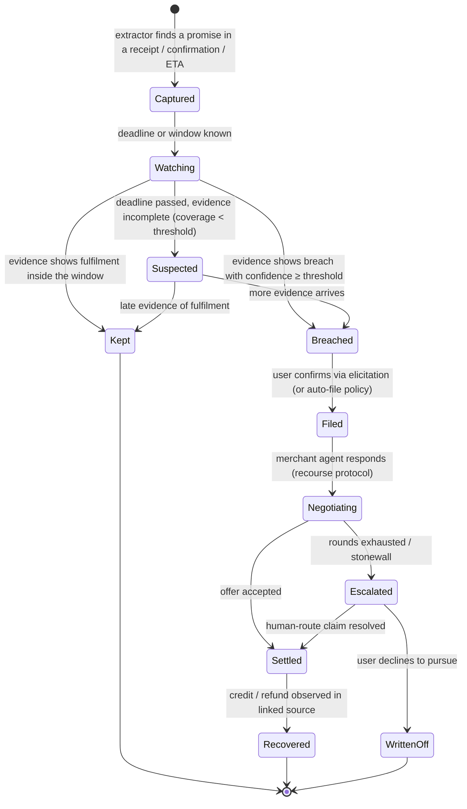
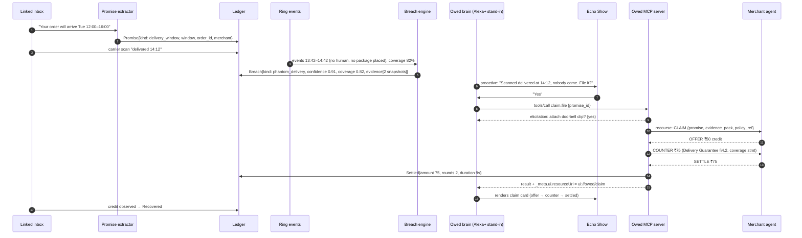

# Owed — the Alexa+ add-on that works for the customer, not the brand

> **"Alexa, what am I owed?"**
> Owed records every promise a business makes to your household — a delivery window, a ride ETA, a refund SLA, a guarantee — notices when it's broken, and collects what you're owed by negotiating with the merchant's agent. You never lift a finger.

Built for **Build, Ship, Shape: Amazon Developer Hackathon 2026** — Alexa+ primary track, AWS Builder and Open Source mini-challenges.

---

## 1. Thesis

Every Alexa+ add-on shipped so far exists so a *brand* can reach a customer. The Alexa+ store is a distribution channel. Owed is the inversion: an add-on whose principal is the **household**, sitting on the customer's side of every transaction those brands run through Alexa.

- **Before** a transaction: nothing to do — you buy, ride, book as usual.
- **During**: Owed captures the promise at the moment it is made (from receipts, confirmations, ETAs).
- **After**: Owed detects the breach with evidence, files the claim, and settles it agent-to-agent with the merchant's agent.

Businesses price in the fact that almost nobody claims. Owed removes the effort, so the breakage comes home.

**Why it belongs in Alexa+:** the design guide asks that an add-on "do at least one thing better because it lives in Alexa+". The promise is captured *in the conversation where it is made*, and the outcome is spoken back in the room where the household lives. Amazon reports customers engage 6× more with integrated services; that only scales if the customer trusts the agent's transactions. Owed is the consumer-side accountability layer — the mirror image of Amazon Wallet.

---

## 2. What the judge sees (90-second storyboard)

| t | Surface | What happens |
|---|---|---|
| 0:00 | Echo Show (kitchen, Tue 18:40) | Owed **speaks first**: "Your parcel was scanned *delivered* at 14:12. Nobody came to the door between 13:42 and 14:42." Two doorbell snapshots slide onto the card. "File it?" — "Yes." |
| 0:20 | Protocol inspector | `tools/call claim.file` → recourse protocol opens with the merchant agent. Card: *Offer ₹50 · Counter (Delivery Guarantee §4.2, coverage 82%) · Settled ₹75 · 2 rounds · 9 s.* |
| 0:40 | Fire TV (Thu, show playing) | Overlay, no interruption: "Your refund promised in 5–7 days is on day 11. I've escalated." |
| 0:55 | Echo Show (Sun) | "Alexa, what am I owed?" → **Recovered this week ₹1,340 · Open ₹420.** |
| 1:05 | Echo Dot (voice-only) | Same query, text-fallback answer — proves the voice-only mode. |
| 1:15 | Timeline scrubber | Judge drags across the week; promises captured, breaches detected, settlements landing. |
| 1:25 | Close | "Alexa+ has hundreds of add-ons that sell to you. This is the one that represents you." |

---

## 3. System architecture

```mermaid
flowchart LR
    subgraph HOUSEHOLD["Household surfaces (simulated home)"]
        ES[Echo Show frame<br/>768×480, Alexa tokens]
        FTV[Fire TV overlay]
        DOT[Echo Dot<br/>voice-only]
        PH[Phone rail]
        TL[Timeline scrubber<br/>week-in-the-life]
        INS[Protocol inspector<br/>live JSON-RPC]
    end

    subgraph STANDIN["Alexa+ stand-ins"]
        SIM[mcp-voice-simulator<br/>OAuth 2.1+PKCE · tools/list · MCP Apps]
        BRIDGE[alexa-skill-mcp-bridge<br/>real Echo via Alexa Skill + AgentCore]
        BRAIN[Owed brain<br/>tool routing · proactive scheduler]
    end

    subgraph OWED["Owed MCP server (real) — Streamable HTTP, spec 2025-11-25"]
        AUTH[Account linking<br/>OAuth 2.1 + PKCE<br/>RFC 9728/8414/7591]
        TOOLS[Tools<br/>promises.list · promise.check<br/>claim.file · claim.status<br/>ledger.summary · evidence.get]
        UI[MCP Apps<br/>ui://owed/ledger · ui://owed/claim<br/>ui://owed/evidence]
        ELIC[Elicitation<br/>"File it?" · "Use the doorbell clip?"]
    end

    subgraph CORE["Core engines"]
        EXT[Promise extractor<br/>Bedrock → typed Promise]
        BRE[Breach engine<br/>promise × evidence → breach + confidence + coverage]
        NEG[Recourse negotiator<br/>claim→offer→counter→settle]
        LED[(Ledger<br/>event-sourced, per household)]
        POL[(Recourse policy library<br/>per-merchant rules, open source)]
    end

    subgraph SOURCES["Evidence & promise sources"]
        INBOX[Linked inbox<br/>receipts, confirmations, ETAs]
        RING[Ring Partner API<br/>doorbell events, snapshots<br/>emulator fallback]
        CLOCK[Timestamps / carrier scans]
    end

    subgraph MERCH["Merchant agents (simulated, open protocol)"]
        M1[Cooperative]
        M2[Stingy]
        M3[Stonewalling]
    end

    ES & FTV & DOT & PH --> SIM
    TL --> BRAIN
    SIM --> BRAIN
    BRIDGE --> TOOLS
    BRAIN --> AUTH --> TOOLS
    TOOLS --> UI
    TOOLS --> ELIC
    TOOLS --> BRE & LED
    INBOX --> EXT --> LED
    RING & CLOCK --> BRE
    BRE --> LED
    TOOLS --> NEG
    NEG <-->|recourse protocol| M1 & M2 & M3
    NEG --> POL
    NEG --> LED
    INS -.observes.- SIM & TOOLS & NEG
```

**Real:** everything in `OWED`, `CORE`, and `SOURCES` (inbox is a seeded test inbox; Ring via emulator unless API access lands).
**Simulated and labelled:** the Alexa+ orchestrator and voice pipeline, proactive delivery to devices, device frames, merchant agents, speaker identity.

---

## 4. Promise lifecycle



Every transition is an event in the ledger. The card and the "recovered this week" number are projections of the event log.

---

## 5. Sequence — the phantom-delivery claim



---

## 6. MCP surface (the real add-on contract)

Server: TypeScript, `@modelcontextprotocol/server` 2.x, **Streamable HTTP**, protocol **2025-11-25**, stateless request handling with ledger-backed state. Target tool latency < 500 ms (breach detection runs async; tools read state).

### 6.1 Account linking
OAuth 2.1 + PKCE (S256) with discovery via RFC 9728 (protected resource metadata) and RFC 8414 (AS metadata); RFC 7591 dynamic client registration supported so the simulator links without pre-config. Owed's own authorization server issues the token; the Owed account in turn holds the linked inbox grant. Must pass `npx mcp-voice-simulator-conformance`.

### 6.2 Tools

| Tool | Input | Output | UI |
|---|---|---|---|
| `ledger.summary` | `{period?: "week"\|"month"}` | `{recovered, open, kept, items[]}` | `ui://owed/ledger` |
| `promises.list` | `{status?: PromiseStatus, merchant?}` | `{promises[]}` | `ui://owed/ledger` |
| `promise.check` | `{promise_id}` | `{status, breach?, coverage, evidence[]}` | `ui://owed/evidence` |
| `claim.file` | `{promise_id, attach_evidence?: boolean}` | `{claim_id, state, offer?, settled?}` (may elicit) | `ui://owed/claim` |
| `claim.status` | `{claim_id}` | `{state, rounds[], amount?}` | `ui://owed/claim` |
| `evidence.get` | `{evidence_id}` | `{kind, uri, captured_at, coverage}` | `ui://owed/evidence` |

All tool results carry `content[]` (text fallback for voice-only devices), `structuredContent`, and `_meta.ui.resourceUri` per the Alexa+ client lifecycle. Tool signatures are frozen after v1 (Alexa+ locks them at certification).

### 6.3 MCP Apps (views)
- `ui://owed/ledger` — headline number, three-item list, one action. 768×480 base canvas, root scale for Echo Show 8/15, 1.6 typography ratio, Alexa tokens.
- `ui://owed/claim` — offer → counter → settled timeline; two-column agent transcript, collapsed by default.
- `ui://owed/evidence` — coverage bar ("watched 82% of window"), snapshots, gaps stated explicitly.
Views are sandboxed iframes with CSP; they call back only via `postMessage` (host bridge), never fetch directly.

### 6.4 Elicitation
Form-mode, flat primitives only — which is the whole of what the spec permits. Both of v1's
questions (*file it?* and *attach the doorbell evidence?*) are asked in **one round** rather
than serially; being asked twice about one claim is worse, not better.

Elicitation runs **only where the connection can carry it.** On the 2026-07-28 revision the
request rides in the result and the client retries, so it works under per-request serving. On
the 2025-11-25 revision it is a server-to-client request that needs a session, and per-request
serving cannot make one — so there `claim_file` proposes in words and waits for `confirm`.
Both paths are tested, including decline. See docs/friction-log.md §10–11; the second is an SDK
bug we shipped from its own worked example before a test caught it.

---

## 7. Recourse protocol (open spec, `packages/recourse-protocol`)

Agent-to-agent dispute resolution, MCP-shaped so any merchant agent can implement it as tools.

```
CLAIM    { claim_id, promise, evidence_pack{items[], coverage}, policy_ref, ask }
OFFER    { claim_id, amount, form: credit|refund|reship, terms }
COUNTER  { claim_id, amount, justification{policy_clause, evidence_ids[]} }
SETTLE   { claim_id, amount, form, reference }
DECLINE  { claim_id, reason, escalation_route }
```

Rules: max N rounds (default 3); every message signed with the claim id; evidence is referenced, never re-sent; a `DECLINE` must carry a human escalation route. Negotiator strategy: reservation value from the policy library, concession schedule by merchant type, stop on `SETTLE ≥ reservation` or rounds exhausted.

Merchant agents in `packages/merchant-agents` are configured per merchant *and breach kind*, because that is what is actually true of merchants: Calder & Co. settles its price promise on request and contests its refund timing, from one configuration. The eval harness runs the **full pre-registered grid of 270 policies × 6 breach kinds = 1,620 negotiations**, including merchants that withdraw an offer when countered.

---

## 8. Core engines

### 8.1 Promise extractor
Input: a message (receipt / confirmation / ETA notification). Output: typed `Promise`:
```ts
type Promise = {
  id: string; household_id: string; merchant: string; source_ref: string;
  kind: "delivery_window" | "eta" | "refund_sla" | "appointment_slot" | "guarantee" | "price_match" | "warranty";
  made_at: string; window?: { start: string; end: string }; deadline?: string;
  amount_at_stake?: number; currency: string; policy_ref?: string; confidence: number;
};
```
Bedrock (Nova 2 Lite) with a strict JSON schema and a rule pass for dates/amounts. Evaluated on a labelled set of 120 seeded messages (precision / recall published in `eval/README.md`).

### 8.2 Breach engine
`breach = f(promise, evidence[])` → `{kind, confidence, coverage, evidence_ids, explanation}`.
- Coverage = fraction of the promise window observed by any evidence source. Below threshold → `Suspected`, never `Breached`. The card says what was and wasn't seen.
- Breach kinds v1: `late_eta`, `missed_window`, `phantom_delivery`, `no_show`, `late_refund`, `price_drop`.
- Evidence kinds v1: `timestamp`, `carrier_scan`, `doorbell_event`, `doorbell_snapshot`, `refund_observed`.

### 8.3 Ledger
Event-sourced (`PromiseCaptured`, `EvidenceAttached`, `BreachDetected`, `ClaimFiled`, `OfferReceived`, `CounterSent`, `Settled`, `Recovered`, …), DynamoDB in cloud / SQLite locally. Projections: ledger summary, per-merchant scorecards, "recovered this week".

### 8.4 Speaking first (`CommitmentEvent`)
Alexa+ add-ons are strictly reactive: a tool runs because somebody said something. For most add-ons that is a limitation; for Owed it removes the product, because Owed exists to notice what the household did *not* ask about.

So the one primitive we need is the one that does not exist, and we wrote it down as a schema rather than a paragraph in a feedback form: **`CommitmentEvent`**, carrying `expires_at` (proactive speech has to be allowed to go stale), `urgency` (only the add-on knows whether money is about to stop being recoverable) and `offer` (without it, an announcement is a dead end).

The server exposes everything Owed would say unprompted as a **projection of the ledger**, not a queue — so scrubbing the week backwards takes an announcement away again instead of replaying it. The brain polls, announces what has newly fallen due, and the home badges every one `simulated proactive`. The inspector shows each event on its own channel.

Full write-up and the rules the scheduler keeps: **[docs/proactive.md](docs/proactive.md)**.

---

## 9. Simulated home (`apps/home`)

React + Vite. One page:
- **Surfaces**: an Echo Show 8 at its documented 768×480 base canvas, and an **Echo Dot with no screen at all**. The Dot is a proof rather than a decoration — voice-only parity is a certification requirement and the easiest thing to fake, so the only honest test is to take the card away and run the storyboard again. If a beat stops making sense there, the spoken line was a caption for a picture, which is a bug in the add-on. *(Fire TV overlay and phone rail: not built — first on the cut list, §16.)*
- **Timeline scrubber**: drag through the seeded week. The clock moves, the ledger is replayed to that instant, and every tool answers for it without any tool knowing a scrubber exists — including whether it has anything to say unprompted. Dragging onto Sunday evening is what makes the proactive beat happen.
- **Voice**: browser SpeechRecognition in, TTS out (browser default; ElevenLabs optional), barge-in supported.
- **Protocol inspector**: live JSON-RPC from simulator → Owed, and the recourse exchange with merchant agents. Every card on the Echo is traceable to a `_meta.ui.resourceUri` in the pane.

The home embeds `mcp-voice-simulator` as the MCP client (account linking, tools/list, MCP Apps sandbox) with a custom **Owed brain** (`src/brains/owed-brain.ts`) that routes utterances to tools and runs the proactive scheduler.

---

## 10. Evaluation (the numbers in the video)

| Metric | Method | Where |
|---|---|---|
| Promise extraction P/R | 120 labelled messages + 40 held out, 7 promise kinds | `eval/src/extraction/` |
| Breach detection P/R by kind | 60 scripted scenarios with evidence timelines, incl. coverage gaps | `eval/src/breach/` |
| Recovery rate & rounds | 270-policy pre-registered grid × 6 breach kinds, negotiator vs. "accept first offer" and "do nothing" | `eval/` |
| Tool latency p95 | k6 against Streamable HTTP endpoint | `eval/latency/` |

**Measured so far (promise extraction, `eval/README.md`):** the rule-based extractor
reaches **100% precision and 99% recall** on the 120-message labelled corpus — and
**73.7% and 58.3%** on forty held-out messages it has never been run against.

That gap is the most useful number in this repository. The corpus figure was reached by
changing the extractor three times in response to the very messages it is scored against,
which is exactly the process that makes a benchmark meaningless. **H1 is met on the corpus
it was tuned against and missed badly on data it has not seen** — held out it finds four
promises in seven, and one in four of the things it reports is wrong.

The held-out set was written after the tuning was finished, run once, and will not be
fixed against. Two of its nine misses are the tuning itself backfiring: a cue word added
to catch one authored phrasing reads a grocery delivery slot and a courier text as
engineer appointments.

**Measured so far (breach detection, `eval/README.md`):** over sixty pre-registered
timelines the engine reaches **93.5% precision** and **100% recall** on the cases it could
see enough of, with an **8.7% false-positive rate** on promises that were actually kept.
**H2 is not met** — it asks for 0.9 precision *per kind* and under 5% false positives, and
two kinds sit at 80% and 75%.

Every remaining failure is one thing: evidence a minute outside the ±30 minute tolerance
is discarded entirely, so a parcel placed 31 minutes after the carrier scanned it still
reads as a phantom delivery. That is a real defect, named rather than quietly fixed in the
same sitting that found it, because fixing it means deciding what a tolerance is *for*.

The number that did come out clean is the one the product rests on: **every** case where a
promise was broken but the camera had been starved was **held back rather than claimed**.

Two defects the corpus did find were fixed, both defensible without reference to any
number: a promise window now counts its closing instant ("delivered by five" includes
five), and a partial refund is a broken promise rather than a kept one. The corpus was
committed *before* either change, and the git history shows that order.

**Measured so far (recourse, `eval/README.md`):** across 1,620 negotiations the negotiator
recovers **33.9%** of what the merchants' own policies say they owe, against **30.8%** for
accepting the first offer — a **1.10× lift** at a **median of two rounds**. It does *worse*
than the baseline in **23.3%** of cells, every one a merchant that withdraws its offer when
challenged.

**With per-merchant priors** — learned from the ledger, over 20 repeat encounters — the
negotiator reaches **44.1%**, a **1.43× lift**, and its loss rate falls to **0%**: after
three encounters it stops arguing with merchants who punish it. Episode one still matches
the cold negotiator exactly, which is the check that proves nothing is leaking.

The pre-registered hypothesis (H3: ≥ 60% and ≥ 1.5×) is **still not met** on either figure,
and `eval/README.md` says so plainly — along with why reaching the oracle here is a property
of simulated merchants being deterministic rather than a claim about the algorithm.

---

## 11. Repository layout

```
owed/
├─ apps/
│  ├─ home/                 # simulated household (React) + embedded mcp-voice-simulator
│  └─ bridge/               # config + generated interaction model for alexa-skill-mcp-bridge
├─ packages/
│  ├─ mcp-server/           # Owed MCP server (Streamable HTTP, OAuth 2.1, tools, ui:// views)
│  ├─ core/                 # extractor, breach engine, ledger, negotiator
│  ├─ recourse-protocol/    # open spec + TS types + conformance tests   (Open Source mini-challenge)
│  ├─ merchant-agents/      # 3 policy agents implementing the protocol
│  ├─ policy-library/       # per-merchant recourse rules (JSON), open source
│  └─ ui-views/             # MCP Apps views (ledger, claim, evidence) built with @modelcontextprotocol/ext-apps
├─ data/
│  ├─ inbox-seed/           # seeded receipts/confirmations for the test inbox
│  ├─ ring-scenarios/       # doorbell event timelines for the emulator
│  └─ scenario-week.json    # the 7-day storyboard the scrubber replays
├─ eval/                    # extraction / breach / recourse / latency harnesses + results
├─ infra/                   # CDK: DynamoDB ledger, Lambda/App Runner for MCP server, Bedrock access
├─ docs/
│  ├─ architecture.md       # this README's diagrams, expanded
│  ├─ real-vs-simulated.md  # honest map, mirrored in the submission
│  ├─ friction-log.md       # per-tool friction entries (10% judging bonus)
│  └─ feature-requests.md   # CommitmentEvent + proactive channel proposals
├─ LICENSE                  # Apache-2.0
└─ README.md
```

---

## 12. Local setup

Everything runs offline. There are no cloud prerequisites: no AWS account, no Bedrock,
no Ring access, no API keys.

```bash
# prerequisites: Node 20+ (repo is pinned to 26 via .nvmrc) and pnpm
pnpm install
pnpm build          # compiles the workspaces and bundles the ui:// views
pnpm demo           # MCP server :3939 · brain :3940 · simulated home :5173
```

Open http://127.0.0.1:5173 and ask *"Alexa, what am I owed?"*.

```bash
pnpm verify         # build + lint + typecheck + tests (the gate CI runs)
pnpm test           # unit, property, storyboard golden, and tool-contract tests
```

The demo runs on **scenario time**, not wall time: the server holds a fixed clock parked
in the seeded week and answers truthfully for wherever that clock is moved to.

```bash
curl -X POST http://127.0.0.1:3939/control/clock \
  -H 'content-type: application/json' \
  -d '{"instant":"2026-10-06T18:40:00-07:00"}'
```

**Built and working today:** the MCP server over Streamable HTTP (spec-current SDK v2),
`ledger_summary` with its `ui://owed/ledger` MCP Apps view, the event-sourced ledger with
replay-to-any-instant, the coverage engine, the seeded storyboard week, the Node brain
holding the MCP client, and the simulated home with the Echo Show frame and a protocol
inspector fed by real captured JSON-RPC frames.

**Not built yet** (see `docs/contract-v1.md` and the plan): OAuth 2.1 account linking and
the conformance gate, the remaining five tools, the claim and evidence views, the breach
detectors, the recourse protocol and merchant agents, the promise extractor, and the
evaluation harnesses.

## 13. Real vs. simulated (mirrored in the submission)

**What "conformance passes" does and does not mean.** Alexa+ for Builders is partner-gated, so
**none of this has run against the real Alexa+ client** — not one tool call, not one card. Every
green check below is against the *documented* contract and the community conformance CLI. The
contract suite asserts what Amazon publishes: every advertised tool invocable, one text block
per result, nothing internal ever spoken, every `ui://` view readable and self-contained under a
deny-by-default CSP, elicitation flat and primitive. Measured: **p95 4.7–35 ms** against a
documented 500 ms target, and **worst-case text contrast 6.36:1** against a required 4.5:1.

Those are real measurements of a real server. They are not evidence that it works on Alexa+, and
nothing in this submission should be read as claiming otherwise.

| Real | Simulated (labelled in UI and README) |
|---|---|
| MCP server, tools, MCP Apps views, elicitation, account linking, conformance | Alexa+ orchestrator, NLU and voice pipeline |
| The `CommitmentEvent` schema and the scheduler that derives it | **Proactive delivery itself — Alexa+ has no such channel.** Badged `simulated proactive` in the UI; see [docs/proactive.md](docs/proactive.md) |
| Promise extraction from seeded inbox (published P/R) | Proactive delivery to devices |
| Breach engine with coverage accounting | Merchant agents (three policies, open protocol) |
| Recourse protocol, negotiator, 20-policy eval | Speaker identity / household roles |
| Event-sourced ledger, cross-session state | Ring events unless Partner API access is granted (emulator otherwise) |

---

## 14. Four-week plan (deadline Oct 23, 12:00 PDT = Oct 24, 00:30 IST; submit Oct 22 IST)

| Week | Deliverable | Exit criterion |
|---|---|---|
| **W1** (to Oct 2) | `core`: Promise schema, extractor, breach engine, ledger; `mcp-server` with 6 tools; conformance passing | extraction & breach P/R numbers exist; `tools/call ledger.summary` returns a card |
| **W2** (to Oct 9) | `recourse-protocol` spec, negotiator, 3 merchant agents, eval harness; `ui-views` at 768×480 | recovery-rate number exists; claim card renders in simulator |
| **W3** (to Oct 16) | `apps/home`: surfaces, scrubber, voice, inspector, proactive badge; bridge deployed for a real-Echo shot | full 90-s storyboard runs end-to-end without a cut |
| **W4** (to Oct 22) | video (<3 min, best 20 s first), README numbers, friction log, feature requests, open-source packages, private-repo collaborators added at submit time | submitted |

Cut order if slipping: bridge/real-Echo shot → Fire TV overlay → phone rail. Never cut: the numbers, the claim card, the inspector.

---

## 15. Submission checklist

- [ ] Primary track: Alexa+ · Mini: AWS Builder (Bedrock extraction, DynamoDB ledger, AgentCore via bridge) · Open Source (`recourse-protocol`, `policy-library`)
- [ ] Repo calls MCP in code (server entry point, `_meta.ui`, elicitation) — not just README
- [ ] Demo video: public YouTube, English, < 3 min, no third-party trademarks or music
- [ ] Product feedback for every tool used: MCP SDK, ext-apps, mcp-voice-simulator, bridge, Bedrock, Ring API/emulator
- [ ] Friction log entries (task, steps, expected vs actual, severity, workaround, suggestion)
- [ ] Feature requests: `CommitmentEvent` from Alexa+ to add-ons; proactive channel for add-ons; speaker identity passthrough
- [ ] Private repo → add `chris-trag knmeiss giolaq anishamalde mosesroth emersonsklar` + `testing@devpost.com` at submit time (invites expire in 7 days)
- [ ] `docs/real-vs-simulated.md` linked from the submission text

---

## 16. License

Apache-2.0. `recourse-protocol`, `policy-library`, and `merchant-agents` are published as standalone packages.